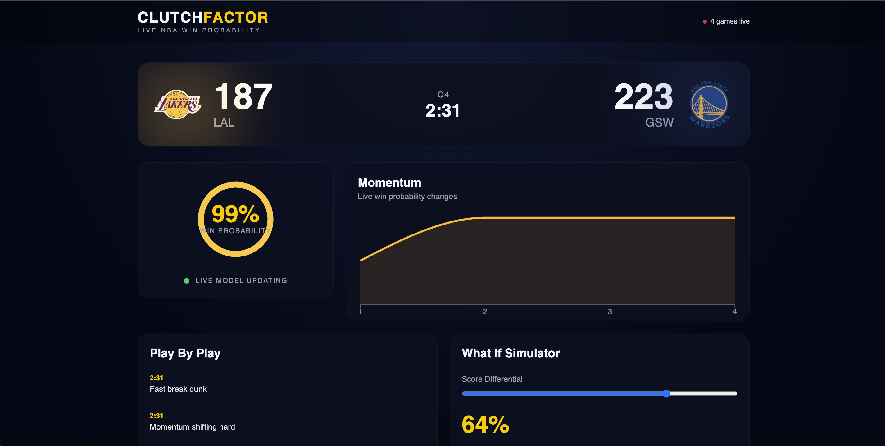

# ClutchFactor

Live NBA win probability analytics platform built with React, Spring Boot, WebSockets, PostgreSQL, and Docker.

ClutchFactor simulates real-time NBA game momentum using live NBA data, a custom probability engine, and real-time event broadcasting to create an interactive analytics experience inspired by modern sports broadcasts.

---

## Features

### Real-Time NBA Dashboard

- Live NBA game tracking

- Auto-updating scores and probabilities

- Real-time ticker for active games

- Smooth animated UI

### Win Probability Engine

- Dynamic win probability calculations

- Real-time momentum updates

- Probability simulation based on game state

### Momentum Analytics

- Live momentum charts

- Historical probability tracking

- PostgreSQL persistence layer

### Interactive Game Experience

- Animated probability ring

- Play-by-play event feed

- “What If” simulation panel

- Team-specific branding and themes

### Infrastructure

- Full-stack Docker setup

- WebSocket event broadcasting

- PostgreSQL database integration

- Environment-based configuration

---

## Tech Stack

### Frontend

- React

- TypeScript

- Vite

- TailwindCSS

- Framer Motion

- Recharts

### Backend

- Java 21

- Spring Boot

- Spring WebSocket

- Spring Data JPA

- Spring Scheduling

### Infrastructure

- PostgreSQL

- Docker

- Docker Compose

### APIs

- BallDontLie NBA API

---

## Architecture

```text

NBA API

   ↓

Spring Boot Backend

   ↓

Probability Simulation Engine

   ↓

PostgreSQL Persistence

   ↓

WebSocket Broadcaster

   ↓

React Frontend

```

---

## Screenshots

### Home Dashboard


### Live Game View


---

## Local Setup

### Clone Repository

```bash

git clone https://github.com/yourusername/clutchfactor.git

cd clutchfactor

```

---

### Backend Setup

```bash

cd backend

```

Create `.env`

```env

BALLDONTLIE_API_KEY=your_api_key

DB_URL=jdbc:postgresql://localhost:5433/clutchfactor

DB_USERNAME=postgres

DB_PASSWORD=password

```

Run backend:

```bash

export $(grep -v '^#' .env | xargs)

./mvnw spring-boot:run

```

---

### Frontend Setup

```bash

cd frontend

```

Create `.env`

```env

VITE_API_URL=http://localhost:8080

```

Install dependencies:

```bash

npm install

```

Run frontend:

```bash

npm run dev

```

---

### Docker Setup

Run the full stack:

```bash

docker compose up --build

```

---

## Environment Variables

### Backend

```env

BALLDONTLIE_API_KEY=

DB_URL=

DB_USERNAME=

DB_PASSWORD=

```

### Frontend

```env

VITE_API_URL=

```

---

## Future Improvements

- Machine learning-based probability engine

- Historical game replay

- Advanced player analytics

- Redis caching layer

- Mobile optimization

- Push notifications for clutch moments

- User authentication and watchlists

---

## Why I Built This

I wanted to build a project that combined:

- real-time systems

- backend architecture

- analytics visualization

- interactive frontend engineering

ClutchFactor was designed to simulate the feel of a live sports analytics platform while showcasing concepts like WebSockets, event-driven architecture, Docker, and full-stack deployment.

---

## License

MIT License