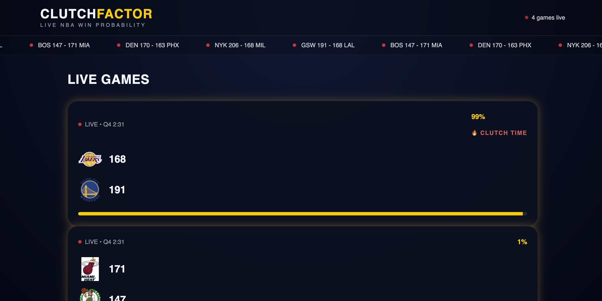

# ClutchFactor

Live NBA analytics platform built with React, Spring Boot, WebSockets, PostgreSQL, and Docker.

ClutchFactor delivers real-time NBA game tracking, live win probability modeling, momentum analytics, and interactive game simulations using live data from the BALLDONTLIE API.

Designed to replicate the feel of a modern sports analytics dashboard with live updates, predictive modeling, and interactive game intelligence.

---

## Features

## Live NBA Dashboard

- Live NBA game tracking using BALLDONTLIE API
- Auto-updating scores, game clock, and win probability
- Real-time WebSocket broadcasting for active games
- Live ticker for ongoing games
- Responsive analytics dashboard UI

## Win Probability Engine

- Custom probability engine based on:
  - score differential
  - game period
  - game context
- Real-time probability recalculation
- Live momentum updates every refresh cycle

## Advanced Game Analytics

Each live game includes:

- Win Probability Ring
- Momentum Chart
- Game Insights Panel with:
  - projected final score
  - clutch rating
  - pace estimate
  - current run
  - largest lead
  - scoring differential

## Interactive Simulation

### What-If Simulator

Users can simulate hypothetical game scenarios:

- score swing adjustments
- probability impact visualization
- live projected win probability changes

Example:

- Current: CLE 61%
- If DET scores next possession: CLE 48%
- Impact: -13%

## Reliability & Production Resilience

- Cached game fallback when API rate limits occur
- Prevents app failure during BALLDONTLIE outages
- Preserves latest valid game state on API failure
- Offseason / no-games demo mode for portfolio reviewers

This ensures the app remains usable even when:
- NBA games are inactive
- external APIs are unavailable
- API rate limits are hit

## Infrastructure

- Full-stack Docker support
- PostgreSQL persistence layer
- Scheduled backend updates
- WebSocket event broadcasting
- Environment-based configuration

---

## Tech Stack

## Frontend

- React
- TypeScript
- Vite
- TailwindCSS
- Framer Motion
- Recharts
- React Router

## Backend

- Java 21
- Spring Boot
- Spring Web
- Spring WebSocket
- Spring Scheduling
- Spring Data JPA

## Database

- PostgreSQL

## Infrastructure

- Docker
- Docker Compose

## External API

- BALLDONTLIE NBA API

---

## System Architecture

```text
BALLDONTLIE API
      ↓
Spring Boot Backend
      ↓
Probability Engine + Analytics Layer
      ↓
PostgreSQL Persistence
      ↓
WebSocket Broadcaster
      ↓
React Frontend
```

---

## Screenshots

## Home Dashboard



## Live Game Analytics


---

## Local Setup

## Clone Repository

```bash
git clone https://github.com/aryamansuri/clutchfactor.git
cd clutchfactor
```

---

## Backend Setup

```bash
cd backend
```

Create `.env`

```env
BALLDONTLIE_API_KEY=your_api_key
DB_URL=jdbc:postgresql://localhost:5433/clutchfactor
DB_USERNAME=postgres
DB_PASSWORD=password
```

Run backend:

```bash
export $(grep -v '^#' .env | xargs)
./mvnw spring-boot:run
```

---

## Frontend Setup

```bash
cd frontend
```

Create `.env`

```env
VITE_API_URL=http://localhost:8080
```

Install dependencies:

```bash
npm install
```

Run frontend:

```bash
npm run dev
```

---

## Docker Setup

Run full stack:

```bash
docker compose up --build
```

Stop containers:

```bash
docker compose down
```

---

## Environment Variables

## Backend

```env
BALLDONTLIE_API_KEY=
DB_URL=
DB_USERNAME=
DB_PASSWORD=
```

## Frontend

```env
VITE_API_URL=
```

---

## Future Improvements

- ML-based win probability model
- Player-level analytics
- Historical game replay mode
- Redis caching
- Mobile-first UI improvements
- User watchlists
- Notifications for clutch moments

---

## Why I Built This

I wanted to build a project combining:

- real-time systems
- predictive analytics
- backend architecture
- event-driven systems
- interactive frontend engineering

ClutchFactor was built to simulate a production-grade live sports analytics platform while showcasing:

- WebSockets
- scheduled backend jobs
- API integration
- caching strategies
- Dockerized deployment
- full-stack architecture

---

## License

MIT License
